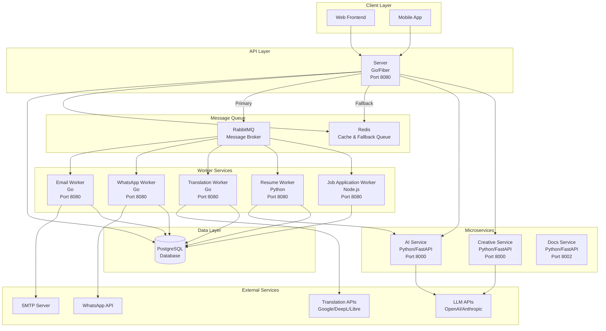

# System Overview

## Architecture Diagram

## Component Overview

### Server (Go/Fiber)
- **Purpose**: Main API server handling HTTP requests
- **Port**: 8080
- **Responsibilities**:
  - REST API endpoints
  - Authentication/authorization
  - Request routing
  - Publishing jobs to RabbitMQ
  - Database operations
  - Redis caching
- **Health Check**: `/healthz` (checks DB, Redis, RabbitMQ)
- **Metrics**: `/metrics` (Prometheus)

### Workers

#### Email Worker (Go)
- **Purpose**: Processes email sending jobs
- **Port**: 8080 (health check)
- **Queue**: `emails.queue`
- **Responsibilities**:
  - Consume email jobs from RabbitMQ
  - Send emails via SMTP
  - Update database with status
- **Health Check**: `/healthz` (checks RabbitMQ)

#### WhatsApp Worker (Go)
- **Purpose**: Processes WhatsApp messaging jobs
- **Port**: 8080 (health check)
- **Queue**: `whatsapp.queue`
- **Responsibilities**:
  - Consume WhatsApp jobs from RabbitMQ
  - Send messages via WhatsApp API
  - Update database with status
- **Health Check**: `/healthz` (checks RabbitMQ)

#### Translation Worker (Go)
- **Purpose**: Processes translation jobs
- **Port**: 8080 (health check)
- **Queue**: `translations.queue`
- **Responsibilities**:
  - Consume translation jobs from RabbitMQ
  - Call translation APIs (Google/DeepL/LibreTranslate)
  - Write translations directly to database
  - Retry logic with exponential backoff
- **Health Check**: `/healthz` (checks RabbitMQ)

#### Resume Worker (Python)
- **Purpose**: Generates resumes with AI assistance
- **Port**: 8080 (health check)
- **Queue**: `resumes.queue`
- **Responsibilities**:
  - Consume resume generation jobs
  - Call AI service for content generation
  - Generate PDF resumes
  - Update database
- **Health Check**: `/healthz` (checks RabbitMQ)

#### Job Application Worker (Node.js)
- **Purpose**: Automates job application processes
- **Port**: 8080 (health check)
- **Queue**: `job-applications.queue`
- **Responsibilities**:
  - Consume job application jobs
  - Web scraping (LinkedIn, job sites)
  - Generate cover letters with AI
  - Update database
- **Health Check**: `/healthz` (checks RabbitMQ)

### Services

#### AI Service (Python/FastAPI)
- **Purpose**: AI/LLM integration service
- **Port**: 8000
- **Responsibilities**:
  - LLM API calls (OpenAI, Anthropic)
  - Text generation
  - AI-powered features
- **Health Check**: `/healthz`
- **Metrics**: `/metrics` (Prometheus)

#### Creative Service (Python/FastAPI)
- **Purpose**: Creative content generation
- **Port**: 8000
- **Responsibilities**:
  - Creative content generation
  - Image generation (via external APIs)
  - Content optimization
- **Health Check**: `/healthz`
- **Metrics**: `/metrics` (Prometheus)

#### Docs Service (Python/FastAPI)
- **Purpose**: Serve technical documentation
- **Port**: 8002 (8000 internally)
- **Responsibilities**:
  - Serve markdown documentation files
  - Convert markdown to HTML with syntax highlighting
  - List and filter documentation files
- **Health Check**: `/healthz` (checks docs directory)
- **Metrics**: `/metrics` (Prometheus)

## Data Flow

### Request Flow (Synchronous)
1. Client → Server (HTTP request)
2. Server → Database (read/write)
3. Server → Redis (cache read/write)
4. Server → AI/Creative Service (if needed)
5. Server → Client (HTTP response)

### Job Processing Flow (Asynchronous)
1. Server → RabbitMQ (publish job)
2. RabbitMQ → Worker (consume job)
3. Worker → External API (if needed)
4. Worker → Database (update status)
5. Worker → RabbitMQ (acknowledge)

### Fallback Flow (RabbitMQ Down)
1. Server detects RabbitMQ unavailable
2. Server → Redis (fallback queue)
3. Health check shows "degraded" status
4. System continues operating

## Technology Stack

### Languages
- **Go**: Server, Email Worker, WhatsApp Worker, Translation Worker
- **Python**: Resume Worker, AI Service, Creative Service, Docs Service
- **Node.js**: Job Application Worker

### Frameworks & Libraries
- **Go**: Fiber (HTTP), GORM (ORM), log/slog (logging), prometheus/client_golang (metrics)
- **Python**: FastAPI (services), structlog (logging), prometheus-client (metrics)
- **Node.js**: Express (HTTP), prom-client (metrics)

### Infrastructure
- **Message Queue**: RabbitMQ (primary), Redis (fallback)
- **Database**: PostgreSQL
- **Cache**: Redis
- **Containerization**: Docker
- **Orchestration**: Kubernetes (partial)

## Key Architectural Patterns

### 1. Microservices Architecture
- Services are independently deployable
- Each service has a single responsibility
- Services communicate via HTTP or message queues

### 2. Event-Driven Architecture
- Asynchronous job processing via RabbitMQ
- Decoupled components
- Scalable worker pattern

### 3. Polyglot Architecture
- Language chosen based on requirements:
  - Go: Performance-critical, concurrent operations
  - Python: AI/ML integration, rapid development
  - Node.js: Web scraping, browser automation

### 4. Resilience Patterns
- Dead Letter Queues (DLQ) for failed messages
- Retry policies with exponential backoff
- Graceful degradation (RabbitMQ → Redis fallback)
- Health checks for all components

### 5. Observability
- Structured logging (JSON in production)
- Prometheus metrics (all components)
- Health checks (all components)
- Trace IDs for request correlation

## Scalability

### Horizontal Scaling
- **Server**: Stateless, can run multiple replicas
- **Workers**: Stateless, multiple workers consume from same queue
- **Services**: Stateless, can run multiple replicas

### Scaling Triggers
- Queue depth > threshold
- CPU usage > 70%
- Memory usage > 70%
- Request latency > threshold

## Security

### Authentication & Authorization
- JWT-based authentication
- Role-based access control (RBAC)
- Session management

### Network Security
- Internal service communication (no public exposure)
- Health checks and metrics endpoints (internal only)
- API endpoints (authenticated)

## Deployment

### Environments
- **Development**: Local Docker Compose
- **Staging**: Railway (or similar)
- **Production**: Railway/Kubernetes

### CI/CD
- GitHub Actions workflows
- Automated testing
- Automated deployment
- Container builds

## Monitoring & Observability

### Logging
- Structured JSON logs in production
- Trace IDs for request correlation
- Service identification in logs

### Metrics
- Prometheus metrics exposed on `/metrics`
- HTTP request metrics
- Worker job processing metrics
- Queue depth metrics

### Health Checks
- All components expose `/healthz`
- Dependency checks (DB, Redis, RabbitMQ)
- Caching (5 seconds) to reduce load

## Future Enhancements

### Planned
- Distributed tracing (OpenTelemetry/Jaeger)
- Grafana dashboards
- Circuit breakers
- Auto-scaling (Kubernetes HPA)
- Read replicas for database

### Under Consideration
- Service mesh (Istio/Linkerd)
- API gateway
- Rate limiting at API gateway level
- Multi-region deployment

## Related Documentation

- [Architecture Decision Records](../adr/) - Key architectural decisions
- [Component Documentation](../components/) - Detailed component docs
- [Development Guides](../development/) - How to extend the system
- [Runbooks](../runbooks/) - Operational procedures
